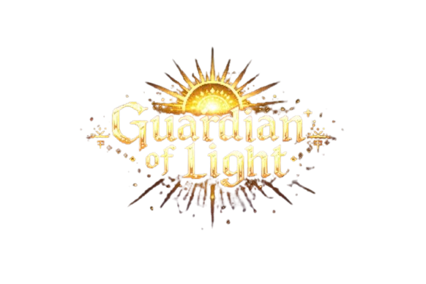
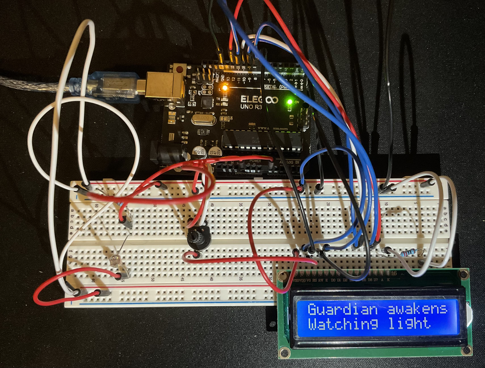
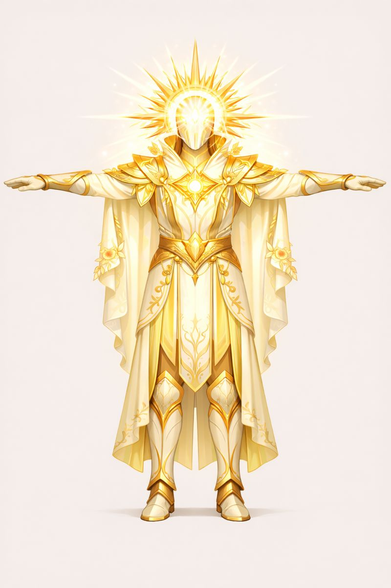
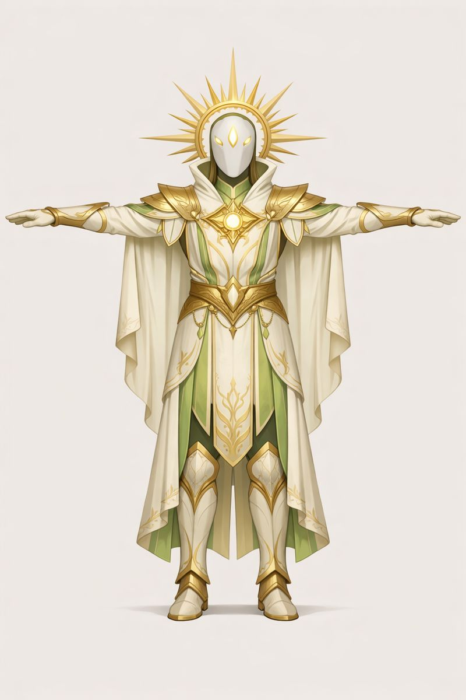
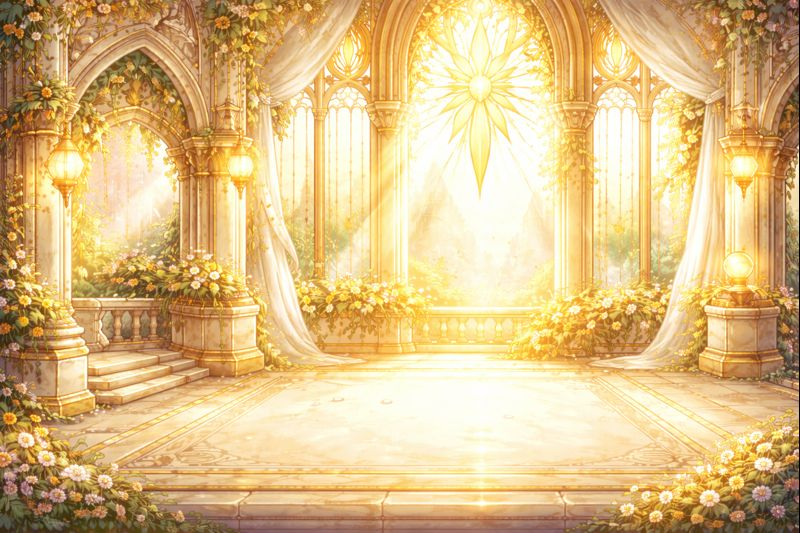
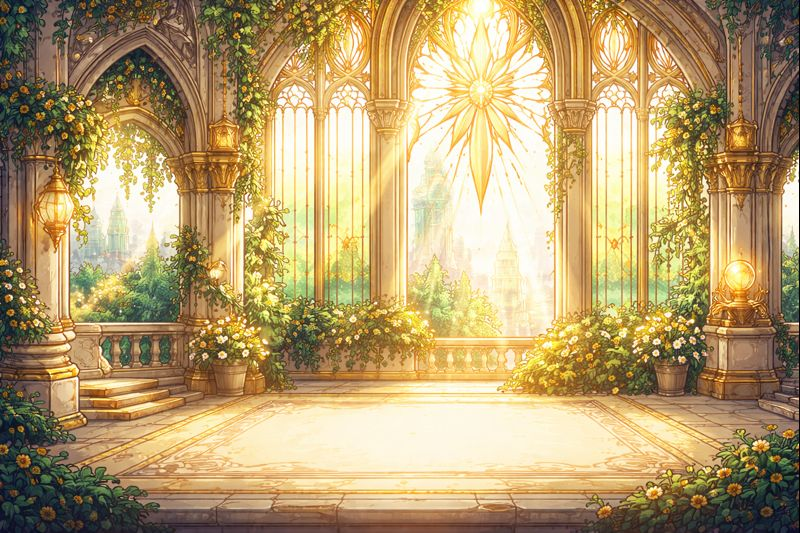
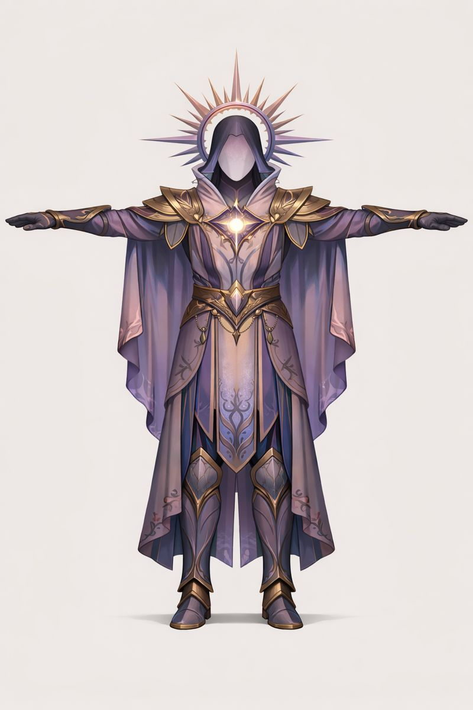
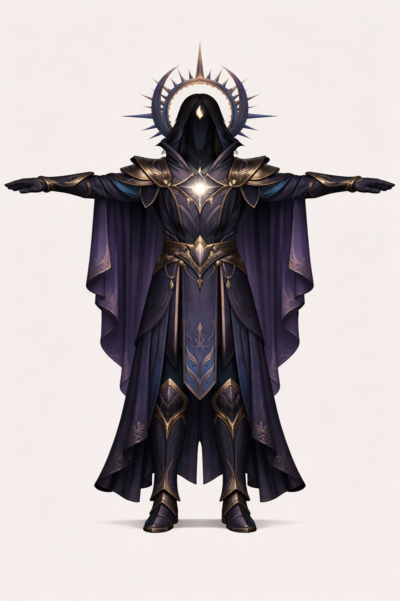
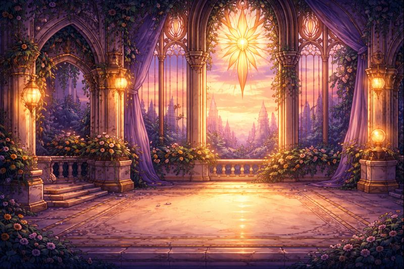
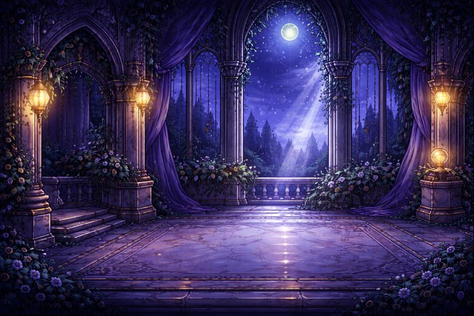

  

# 🕯 Guardian of Light

Guardian of Light is an ambient, time-aware sentinel that watches the shifting light and responds with quiet, gothic-solarpunk commentary. 

More concretely, it is an Arduino-based light-sensitive display that interprets brightness as emotional and temporal states.

This project grew in stages as I worked my way through the default tutorials that come with the `Elegoo (Arduino) UNO R3` starter kit ([lessons 14 - LCD Display and 18 - Photocell](https://www.elegoo.com/blogs/arduino-projects/elegoo-uno-project-super-starter-kit-tutorial?srsltid=AfmBOor6DaxOBq6HDRajndjfSgx16R76wg1IPKePakavL760NIDAJRrJ)). 

The steps below follow that same path so you can build your own Guardian of Light from the ground up.

## Features

📟 Arduino light sensing and LCD output  
🧠 LLM-generated text  
🗣 Text to speech voice output  
🧍 Animated 3D character in Three.js 
📜 Typewriter-style scroll UI  
🕰 Time-aware state switching  

## Setup

### 1. Arduino and Light Sensing

Start with the physical core of the system.

- Install the Arduino IDE.
- Build the LCD circuit from the starter kit.
- Add the photoresistor using a voltage divider.
- Upload the `.ino` file in this repo to your Arduino.
- Click on `Serial Monitor` (magnifying glass in top-right corner of the Arduino IDE) and check that states are changing when you shine a light at the photocell or cover it with your finger. 

Now that we've given our Guardian "senses", let's give them a body. 

### 2. Web Interface

The frontend is a static Three.js project. To run it locally from VSCode, right click the `index.html` file and select `Open with Live Server`, it should a open a new tab in your browser.

At this stage, the Guardian is visual only. It will display placeholder or offline text, but it will not yet generate new content. 

This is where you can/should have fun with customization. 

New assets can easily be generated with any image model. I used GPT5.2 to create:
- A logo
- A scroll-looking text box
- A set of backgrounds
- A set of character t-poses

<table>
  <tr>
    <td align="center">
      
    </td>
    <td align="center">
        
    </td>
    <td align="center">
        
    </td>
    <td align="center">
        
    </td>
  </tr>
  <tr>
    <td align="center">
        
    </td>
    <td align="center">
        
    </td>
    <td align="center">
        
    </td>
    <td align="center">
        
    </td>
  </tr>
</table>

Then, use [Tencent's 3D model](https://3d.hunyuan.tencent.com/), for free, to turn your 2D t-posed character into a 3D model that you can optionally animate using their default actions. When generating the model, select 50K faces to ensure the animation renders. They have a time limit on how long it can take, and with many millions of faces, the request will time out. 

### 3. Online Mode

To enable live text generation and speech, you will need API access.

Set the following environment variables:
- An OpenAI API key
- An ElevenLabs API key

Once those are set, run the Python script. This activates online mode.

In this mode

- Light state changes from the Arduino trigger new text generation
- The LCD updates with new lines
- The webpage updates with new lines
- The Guardian speaks each line aloud

That's it!

---

*spob pǝʍoɹɹoq ɟo ǝɔıoʌ ǝɥʇ uı sʞɐǝds puɐ ʇɥɓıʃ oʇ suǝʇsıʃ ǝuıɥɔɐɯ ɐ 'ɥʇʎɯ puɐ ɹǝʇʇɐɯ uǝǝʍʇǝq ǝɹǝɥʍǝɯoS*
